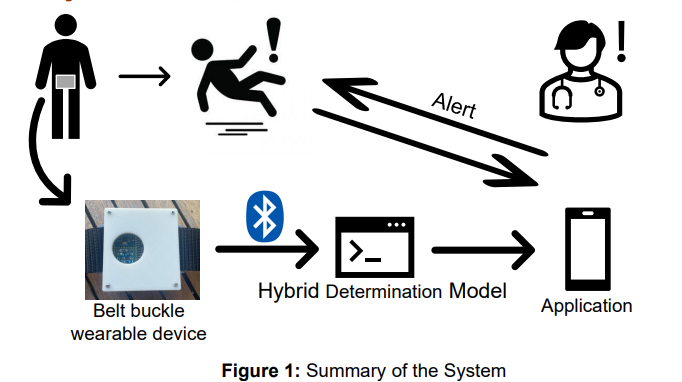
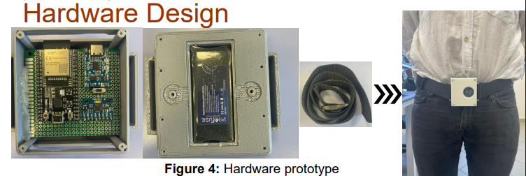
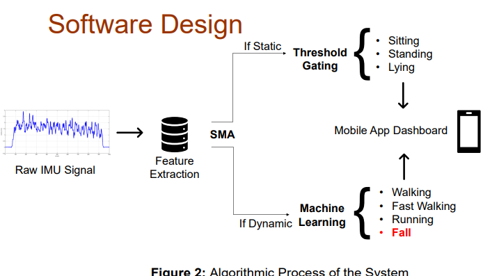
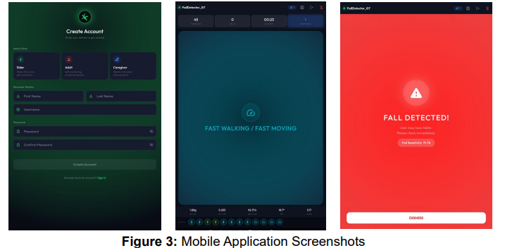
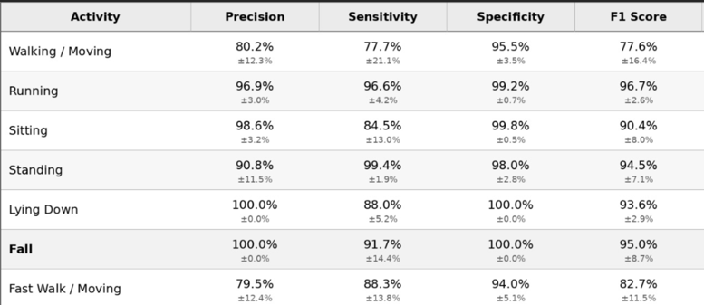

# Real-Time IMU-Based Fall Detection and Alert System

This repository contains a portfolio version of our senior design project, **An Integrated Wearable System for Posture, Mobility and Fall Risk Monitoring**.

The project is a belt-mounted wearable fall detection system that uses an **ESP32 microcontroller**, an **MPU6050 IMU sensor**, **Bluetooth Low Energy (BLE)** communication, real-time signal processing, and a hybrid decision pipeline combining threshold-based posture detection with a machine learning model.

The system was designed to monitor real-time mobility states and detect fall events with low latency, then notify a paired caregiver through a mobile application.

---

## Project Overview

Falls are a serious health risk for elderly people, especially when emergency response is delayed. This project aims to provide a lightweight, non-invasive, privacy-preserving wearable system that can detect falls and send fast alerts without using cameras or environmental sensors.

The system classifies the following mobility and posture states:

* Walking / Moving
* Fast Walking / Fast Moving
* Running
* Sitting
* Standing
* Lying
* Fall

The wearable device is placed around the waist to better capture the body's center-of-mass motion using inertial sensor data.

Video Link for Demonstration: https://www.youtube.com/shorts/1kAmYmy3mSA

---

## Key Features

* Real-time IMU data acquisition using MPU6050
* 200 Hz triaxial acceleration and gyroscope sampling
* ESP32-based embedded signal processing
* Sliding-window feature extraction
* BLE-based feature transmission to a mobile application
* Threshold-based static posture detection
* MLP-based dynamic movement and fall classification
* Physics-based fall validation using SMA, body tilt, peak acceleration, and jerk
* Android mobile application for live activity monitoring and caregiver alerts
* Controlled prototype evaluation with fall sensitivity and latency measurements

---

## System Architecture

The system consists of three main components:

1. **Wearable Hardware Unit**
   The ESP32 collects IMU data from the MPU6050 sensor, extracts motion features, and transmits the processed feature vector through BLE.

2. **Hybrid Decision Pipeline**
   Static postures are classified using lightweight threshold-based rules. Dynamic movements and candidate fall events are classified using a trained MLP model and verified with physical validation gates.

3. **Mobile Application**
   The Android application receives BLE packets, displays the user’s current activity state, and sends emergency alerts to a paired caregiver when a verified fall is detected.



---

## Hardware Components

* ESP32 development board
* MPU6050 6-axis IMU sensor
* 3.7 V LiPo battery
* TP4056 charging module
* Power switch
* 3D-printed enclosure
* Belt-mounted wearable housing

The prototype was designed as a waist-mounted wearable device to improve comfort and capture torso-level motion patterns.



---

## Signal Processing and Feature Extraction

The ESP32 samples triaxial accelerometer and gyroscope data at 200 Hz. The incoming sensor stream is segmented using a sliding-window approach.

The extracted features include:

* Acceleration magnitude statistics
* Gyroscope magnitude statistics
* Axis-wise mean, maximum, and standard deviation
* Signal Magnitude Area (SMA)
* Body tilt angle
* Maximum jerk
* Mean jerk

These features are transmitted to the mobile application through BLE instead of sending raw continuous IMU streams.

---

## Hybrid Decision Pipeline

The system uses a hybrid decision structure:

* **Static states** such as Sitting, Standing, and Lying are detected using threshold-based rules based on SMA and body tilt.
* **Dynamic states** such as Walking, Fast Walking, Running, and Fall are classified using a trained MLP model.
* **Candidate fall events** are passed through an additional validation layer using physical constraints such as jerk, acceleration peak, and body orientation.

This design reduces unnecessary computation and improves fall detection reliability.



---

## Mobile Application

The Android mobile application acts as the monitoring and emergency response interface.

Main functions:

* BLE connection with the ESP32 wearable device
* Live activity state display
* Role-based user structure for elder, caregiver, and adult users
* Firebase-based authentication and pairing logic
* Local alarm on the elder device
* Push notification to the paired caregiver after a verified fall event

The full mobile application source code and Firebase configuration files are not included in this public repository for privacy and security reasons.



---

## Results

The final prototype was evaluated under controlled test conditions with five subjects.

Main results:

* Fall sensitivity: **91.7%**
* Fall precision: **100%**
* Fall F1 score: **95.0%**
* Alert latency: **within 1.5 seconds**
* No fall false alarms observed during tested activities of daily living under controlled conditions

These results show that the system met its main design goal of detecting falls and generating caregiver alerts within the required response window.




## Code Included

This repository includes:

* ESP32 firmware for IMU sampling, feature extraction, and BLE transmission
* Python training script for dynamic movement and fall classification
* Documentation of the system architecture, hardware layout, and results
* Selected project visuals from the report and poster

This repository does not include:

* Raw SisFall dataset files
* Full Android application source code
* Firebase configuration files
* Private credentials
* User data
* Full project report source files

---

## Dataset Notice

The machine learning model was developed using the SisFall dataset. Raw dataset files are not included in this repository due to dataset ownership and licensing considerations.

The training script expects the dataset directory to be placed locally by the user.

Example expected path:

```text
SisFall_dataset/
```

---

## Security and Privacy Notice

The full mobile application backend logic, Firebase credentials, API keys, authentication configuration files, and user-related data are intentionally excluded from this repository.

This repository is mainly shared as a technical portfolio demonstration of the embedded system, signal processing, and machine learning pipeline.

---

## Authors

* Berk Turbil
* Okan Yuğaç

Senior Design Project
Department of Electrical and Electronics Engineering
Koç University
## License
This project is licensed under the MIT License. See the [`LICENSE`](LICENSE) file for details.
